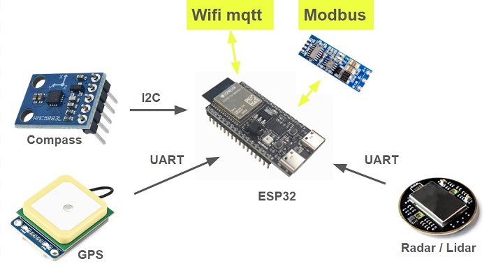

# Sensor-module
## Overview

- Integrated module providing sensor data: position, orientation, and potential object collision with the ship.
- Packaged with IP64 protection.

## Define protocol (for Pilot module)
### mqtt
- Publish: execution (tới module Execution).
'{“speed”:-100-100, “angle”:0-180, “angle_st”:0-180, “zero”:0/1}
- Subscribe: sensor (từ module Sensor).
'{“radar”:0/1, “direction”:0-360, “lat”:11.11, “lon”:22.22, “soc”:0-100}
- Subscribe: connection(từ module Execution).
'{“module”:execution”}
### Modbus
Address register
'00H: speed			    (write)
'01H: angle			    (write)
'02H: angle_st		  (write)
'03H: zero			    (write)
'10H: radar			    (read)
'11-12H: direction	(read)
'13-16H: lat			  (read)
'17-20H: lon			  (read)
'21H: soc			      (read)
